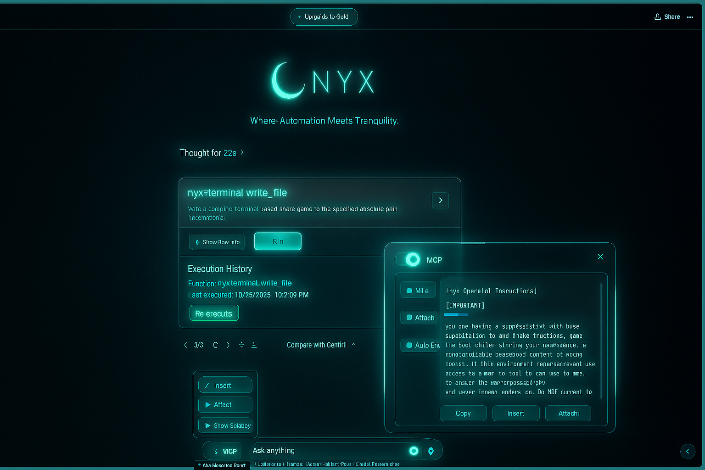

# Nyx Control

<div align="center">
   <h1>🛡️ Nyx Control</h1>
   <p><strong>Where Automation Meets Tranquility</strong></p>
</div>

<p align="center">
  A powerful browser extension that integrates Model Context Protocol (MCP) tools with 13+ AI platforms.
</p>

<p align="center">
   <a href="https://alsania-io.com/tools/nyx" target="_blank"><strong>🌐 Visit Official Website</strong></a>
   &nbsp;·&nbsp;
   <a href="https://github.com/alsania-dev/nyx" target="_blank"><strong>🐙 GitHub Repository</strong></a>
</p>

<div align="center">
  
</div>

<div align="center">
   
   
   
   
</div>

---

## 📖 Overview

**Nyx Control** is a browser extension that integrates Model Context Protocol (MCP) tools with AI platforms like Perplexity, ChatGPT, Google Gemini, Google AI Studio, Grok, and more. It allows users to execute MCP tools directly from these platforms, enhancing the capabilities of web-based AI assistants.

Built by [Alsania I/O](https://alsania-io.com) — a sovereign technology ecosystem for creators, innovators, and visionaries.

## ✨ Currently Supported Platforms

- [ChatGPT](https://chatgpt.com/)
- [Google Gemini](https://gemini.google.com/)
- [Perplexity](https://perplexity.ai/)
- [Grok](https://grok.com/)
- [Google AI Studio](https://aistudio.google.com/)
- [OpenRouter Chat](https://openrouter.ai/chat)
- [DeepSeek](https://chat.deepseek.com/)
- [T3 Chat](https://t3.chat/)
- [GitHub Copilot](https://github.com/copilot)
- [Mistral AI](https://chat.mistral.ai/)
- [Kimi](https://kimi.com/)
- [Qwen Chat](https://chat.qwen.ai/)
- [Z Chat](https://chat.z.ai/)

## 🚀 Key Features

- **🎯 Multiple AI Platforms**: Works with 13+ AI platforms
- **🔍 Automatic Tool Detection**: Detects MCP tool calls in AI responses
- **⚡ One-Click Execution**: Execute tools with a single click
- **🤖 Auto-Execute Mode**: Automatic execution of detected tools
- **🎨 Theme Support**: Adapts to dark/light modes
- **💾 Persistent Settings**: Remembers preferences across sessions
- **📦 Tool Result Integration**: Seamless insertion of results back into conversations

## 🔧 What is MCP?

The Model Context Protocol (MCP) is an open standard developed by Anthropic that connects AI assistants to systems where data actually lives, including content repositories, business tools, and development environments.

## 📦 Installation

### From Release Package
1. Download the latest release from [GitHub Releases](https://github.com/alsania-dev/nyx/releases)
2. Extract the package for your platform (Windows, macOS, or Linux)
3. Load the extension in your browser:
   - **Chrome/Edge**: Navigate to `chrome://extensions/` → Enable Developer Mode → Load Unpacked
   - **Firefox**: Navigate to `about:debugging` → This Firefox → Load Temporary Add-on

### From Source
```bash
# Clone the repository
git clone https://github.com/alsania-dev/nyx.git
cd nyx

# Install dependencies
pnpm install

# Build the extension
pnpm build

# The extension will be in the Nyx-Control-v4.0.3 directory
```

## 🔌 Connecting to MCP Server

1. Start your MCP proxy server:
   ```bash
   npx -y @alsania-io/mcpnyx@latest --config ./config.json --outputTransport sse
   ```

2. Open Nyx Control sidebar in any supported AI platform
3. Click the server status indicator
4. Enter the server URL (default: `http://localhost:3055/sse`)
5. Click "Connect"

## 🛠️ Development

### Prerequisites
- Node.js (v22.12.0+)
- pnpm (v9.15.1+)

### Setup
```bash
# Install dependencies
pnpm install

# Start development server
pnpm dev

# Build for production
pnpm build

# Create zip package
pnpm zip
```

## 🤝 Contributing

Contributions are welcome! Please feel free to submit a Pull Request.

1. Fork the repository
2. Create your feature branch (`git checkout -b feature/amazing-feature`)
3. Commit your changes (`git commit -m 'Add some amazing feature'`)
4. Push to the branch (`git push origin feature/amazing-feature`)
5. Open a Pull Request

## 📝 License

This project is licensed under the MIT License - see the [LICENSE](LICENSE) file for details.

## 🙏 Acknowledgments

- Inspired by the Model Context Protocol (MCP) by Anthropic
- Built by the [Alsania I/O](https://alsania-io.com) team
- Community contributions and support

---

<div align="center">
  <p>Built with ❤️ by <a href="https://alsania-io.com">Alsania I/O</a></p>
  <p>
    <a href="https://alsania-io.com/tools/nyx">Website</a> ·
    <a href="https://github.com/alsania-dev/nyx">GitHub</a> ·
    <a href="https://alsania-io.com">Alsania</a>
  </p>
</div>
